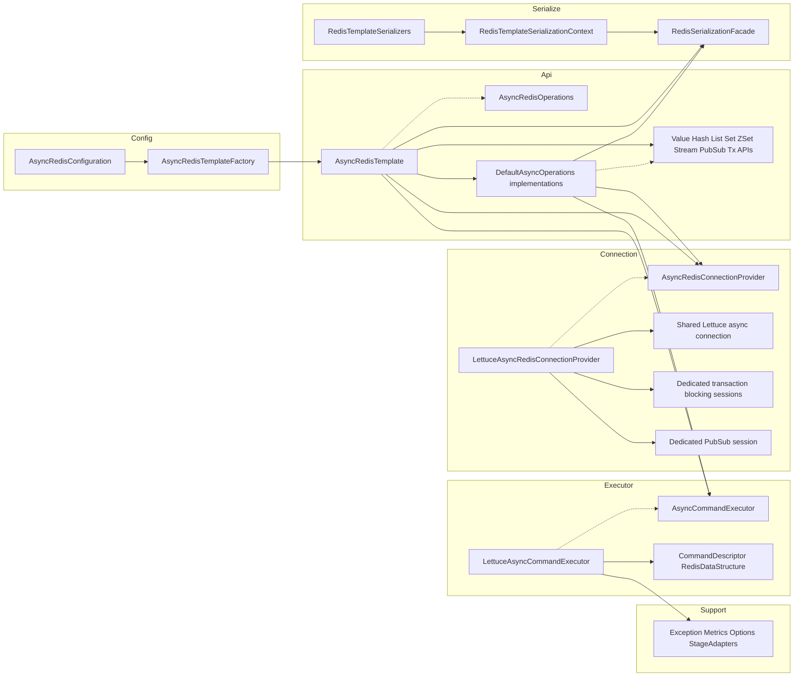
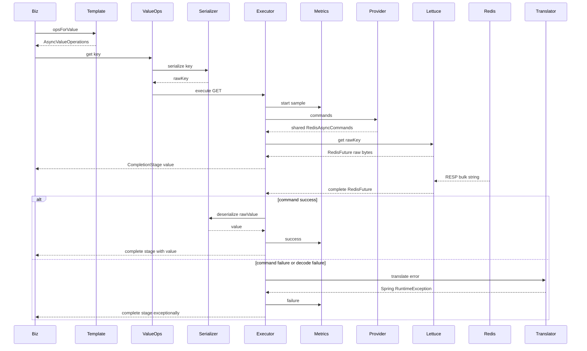

# AsyncRedisTemplate

一个基于 Spring Boot + Spring Data Redis + Lettuce 的 future 风格异步 Redis 访问层。

它的目标不是替代 `ReactiveRedisTemplate`，而是在保留 `RedisTemplate` 使用习惯的前提下，提供一套统一返回 `CompletionStage<T>` 的异步 API。

## 版本要求

当前项目基于 Spring Boot 3.x 技术栈：

- JDK：最低 Java 17，当前 `pom.xml` 配置为 `<java.version>17</java.version>`；可以在 JDK 21 上开发和运行。
- Spring Boot：`3.3.5`
- Spring Framework：随 Spring Boot 3.3.5 管理，属于 Spring Framework 6.x
- Spring Data Redis：随 Spring Boot 3.3.5 管理，属于 Spring Data 2024.x 对应版本
- Lettuce：通过 `spring-boot-starter-data-redis` 间接引入，版本由 Spring Boot 依赖管理控制
- Micrometer：通过 `micrometer-core` 引入，版本由 Spring Boot 依赖管理控制

该项目不能直接在 JDK 8 项目中使用。原因是 Spring Boot 3 / Spring Framework 6 最低要求 Java 17，并且当前源码使用了 `record`、`List.of`、`Map.of`、`instanceof` 模式匹配等 Java 8 不支持的语法或 API。

如果要支持 JDK 8，需要单独维护兼容分支，通常需要降级到 Spring Boot 2.7.x / Spring Framework 5.3.x / Spring Data Redis 2.7.x，并改写 Java 9+ 语法和 API。

## 设计目标

- API 风格尽量贴近 `RedisTemplate`，通过 `opsForValue()`、`opsForHash()` 暴露访问入口。
- 返回类型统一为 `CompletionStage<T>`，便于在普通 Spring MVC / service 层直接使用 future 链式编排。
- 底层直接复用 Lettuce 原生 async API，不引入 `ReactiveRedisTemplate`。
- 不暴露 `RedisFuture`，对业务层屏蔽 Lettuce 细节。
- 复用现有 `RedisTemplate` 的 serializer，保证同步模板和异步模板序列化结果一致。
- 统一处理命令执行、异常翻译、metrics 打点，支持后续按相同模式继续扩展命令族。

## 和 RedisTemplate / ReactiveRedisTemplate 对比

| 维度 | RedisTemplate | AsyncRedisTemplate | ReactiveRedisTemplate |
| --- | --- | --- | --- |
| 编程模型 | 同步阻塞 | `CompletionStage` 异步 | Reactor 响应式 |
| 返回类型 | 直接值 | `CompletionStage<T>` | `Mono<T>` / `Flux<T>` |
| 底层 I/O | 调用方通常以阻塞方式使用 | Lettuce async，非阻塞 I/O | Lettuce reactive，非阻塞 I/O |
| 业务侵入性 | 最低 | 低，适合现有 imperative 项目 | 较高，需要 Reactor 体系 |
| serializer 复用 | 原生支持 | 原生复用 `RedisTemplate` serializer | 通常单独配置 `RedisSerializationContext` |
| 适用场景 | 同步服务 | 想避免阻塞但不想全面引入 Reactor | WebFlux / 响应式全链路 |

可以把它理解成一个中间方案：

- 如果你已经在用 `RedisTemplate`，但希望服务层改成异步链式调用，`AsyncRedisTemplate` 更合适。
- 如果你已经是 Reactor / WebFlux 全栈，`ReactiveRedisTemplate` 更自然。

## 使用方式

### 1. 自动装配

项目提供自动配置，在已有 `redisTemplate` / `stringRedisTemplate` 的前提下，会自动注册：

- `asyncRedisTemplate`
- `asyncStringRedisTemplate`

默认配置类是：

- `com.zuomaigai.redis.async.config.AsyncRedisConfiguration`

### 2. 注入并使用

```java
@Service
public class UserProfileService {

    private final AsyncRedisTemplate<String, String> redis;

    public UserProfileService(
            @Qualifier("asyncStringRedisTemplate") AsyncRedisTemplate<String, String> redis
    ) {
        this.redis = redis;
    }

    public CompletionStage<UserProfile> save(String id, UserProfileUpsertRequest request) {
        Map<String, String> fields = new LinkedHashMap<>();
        fields.put("displayName", request.displayName());
        fields.put("email", request.email());
        fields.put("city", request.city());

        return redis.<String, String>opsForHash()
                .putAll("example:user:profile:" + id, fields)
                .thenCompose(ignored -> redis.opsForValue()
                        .set("example:user:status:" + id, "ACTIVE", Duration.ofMinutes(30)))
                .thenCompose(ignored -> get(id));
    }

    public CompletionStage<UserProfile> get(String id) {
        CompletionStage<Map<String, String>> profileStage =
                redis.<String, String>opsForHash().entries("example:user:profile:" + id);
        CompletionStage<String> statusStage =
                redis.opsForValue().get("example:user:status:" + id);

        return profileStage.thenCombine(statusStage, (entries, status) -> {
            if (entries == null || entries.isEmpty()) {
                return null;
            }
            return new UserProfile(
                    id,
                    entries.get("displayName"),
                    entries.get("email"),
                    entries.get("city"),
                    status
            );
        });
    }
}
```

### 3. 在 Controller 中直接返回 CompletionStage

```java
@RestController
@RequestMapping("/api/users")
public class UserProfileController {

    private final UserProfileService service;

    public UserProfileController(UserProfileService service) {
        this.service = service;
    }

    @PutMapping("/{id}")
    public CompletionStage<UserProfile> putProfile(
            @PathVariable String id,
            @RequestBody UserProfileUpsertRequest request
    ) {
        return service.save(id, request);
    }
}
```

### 4. 复用自定义 RedisTemplate 的 serializer

如果你已经有自己的 `RedisTemplate<K, V>`，可以直接基于它创建异步模板：

```java
@Bean
AsyncRedisTemplate<String, UserProfile> asyncUserProfileRedisTemplate(
        AsyncRedisTemplateFactory factory,
        @Qualifier("userProfileRedisTemplate") RedisTemplate<String, UserProfile> redisTemplate
) {
    return factory.create(redisTemplate);
}
```

这会直接复用原模板上的：

- key serializer
- value serializer
- hash key serializer
- hash value serializer

### 5. Demo：异步调用，同步等待结果

如果你的上层还是同步调用方，也可以在边界层把异步结果等待回来。这个模式适合 demo、迁移阶段或者少量同步桥接代码，不建议作为默认用法铺开。

```java
@Service
public class UserProfileService {

    public UserProfile getBlocking(String id) {
        try {
            return get(id).toCompletableFuture().get(5, TimeUnit.SECONDS);
        } catch (InterruptedException e) {
            Thread.currentThread().interrupt();
            throw new IllegalStateException("Interrupted while waiting for async Redis result", e);
        } catch (TimeoutException e) {
            throw new IllegalStateException("Timed out while waiting for async Redis result", e);
        } catch (ExecutionException e) {
            throw new IllegalStateException("Async Redis call failed", e.getCause());
        }
    }
}

@RestController
@RequestMapping("/api/users")
public class UserProfileController {

    @GetMapping("/blocking/{id}")
    public ResponseEntity<UserProfile> getProfileBlocking(@PathVariable String id) {
        UserProfile profile = userProfileService.getBlocking(id);
        if (profile == null) {
            return ResponseEntity.notFound().build();
        }
        return ResponseEntity.ok(profile);
    }
}
```

项目里的完整 demo 已实现：

- `PUT /api/users/blocking/{id}`
- `GET /api/users/blocking/{id}`

这两个接口内部仍然走 `AsyncRedisTemplate`，只是 controller/service 边界同步等待结果后再返回。

## 支持范围

当前版本支持普通 KV / Hash / List / Set / ZSet 命令，以及事务、阻塞 list、Pub/Sub、Stream 基础能力。

### 通用 key 命令

- `delete(key)`
- `delete(keys)`
- `hasKey`
- `expire`
- `persist`
- `getExpire`

### Value 命令

- `get`
- `set`
- `set(key, value, ttl)`
- `setIfAbsent`
- `setIfPresent`
- `getAndSet`
- `multiGet`
- `multiSet`
- `increment`
- `increment(key, delta)`
- `decrement`
- `decrement(key, delta)`

### Hash 命令

- `get`
- `hasKey`
- `put`
- `putIfAbsent`
- `putAll`
- `multiGet`
- `delete`
- `entries`
- `keys`
- `values`
- `size`
- `increment(key, hashKey, long delta)`
- `increment(key, hashKey, double delta)`

### List 命令

- `range`
- `trim`
- `size`
- `leftPush`
- `leftPushAll`
- `rightPush`
- `rightPushAll`
- `leftPop`
- `rightPop`
- `leftPop(timeout, keys)` 对应 `BLPOP`
- `rightPop(timeout, keys)` 对应 `BRPOP`

### Set 命令

- `add`
- `remove`
- `pop`
- `pop(key, count)`
- `move`
- `size`
- `isMember`
- `members`

### ZSet 命令

- `add(key, value, score)`
- `add(key, tuples)`
- `remove`
- `incrementScore`
- `score`
- `rank`
- `reverseRank`
- `range`
- `rangeWithScores`
- `size`

### 事务

- `executeTransaction(callback)` 对应 `MULTI/EXEC`
- `executeTransaction(watchKeys, callback)` 对应 `WATCH + MULTI/EXEC`
- `executeTransactionWithResult(callback)` 用于返回命令句柄上下文并读取 `EXEC` 结果
- `executeTransactionWithResult(watchKeys, callback)` 用于带 `WATCH` 的句柄型事务

### Pub/Sub

- `publish`
- `subscribe`
- `psubscribe`

### Stream

- `add` 对应 `XADD`
- `acknowledge` 对应 `XACK`
- `createGroup` 对应 `XGROUP CREATE`
- `destroyGroup` 对应 `XGROUP DESTROY`
- `range` 对应 `XRANGE`
- `read(options, offsets)` 对应 `XREAD`
- `read(consumer, options, offsets)` 对应 `XREADGROUP`
- `trim` 对应 `XTRIM`

## 限制

- 不使用 `ReactiveRedisTemplate`
- 不暴露 `RedisFuture`
- 不允许在生产调用链中通过 `future.get()` / `join()` 阻塞线程
- 事务当前只支持 standalone Redis；cluster 连接不支持 `MULTI` / `EXEC` / `WATCH`
- 阻塞命令当前只支持 list 的 `BLPOP` / `BRPOP`
- Pub/Sub 当前只覆盖基础 publish / subscribe / pattern subscribe，不包含更高层封装
- Stream 当前只覆盖基础追加、读、消费组、ack 和 trim，不包含完整消费者容错模型
- 仍不支持 scan / cursor 类命令
- 仍不支持脚本执行和显式 pipeline 控制
- 仍未覆盖 `RedisTemplate` 的全部命令面，bitmap、geo、hyperloglog 等还未实现

## 实现说明

### 源码结构关系图



### 命令执行时序图

以下以 `asyncRedisTemplate.opsForValue().get(key)` 为例。普通 KV / Hash / List / Set / ZSet 命令走共享 Lettuce async connection；事务、阻塞 list、Pub/Sub、阻塞 Stream read 会在连接层打开 dedicated session 或 pubsub session。



### 连接模型

- 默认使用共享 Lettuce 连接，不做命令级 borrow / return
- 底层使用 `byte[] -> byte[]` 命令视图，统一由 serializer 负责编解码
- 对 standalone 和 cluster 都可以工作，连接提供者是 `LettuceAsyncRedisConnectionProvider`

### 异常处理

- 对外统一表现为 `CompletionStage` 异常完成
- Lettuce 超时等异常会被翻译成 Spring 风格异常
- 命令执行、异常翻译、metrics 打点都集中在执行器中处理

### 解码线程

- 默认沿用当前执行链
- 可以通过 `AsyncRedisTemplateOptions` 配置 `decodeExecutor`
- 如果 value/hash value 反序列化较重，可以把解码切到独立线程池

## 最小示例

项目里已经包含一个最小 Spring Boot 示例：

- 应用入口：`src/main/java/com/zuomaigai/redis/example/AsyncRedisExampleApplication.java`
- 示例 Service：`src/main/java/com/zuomaigai/redis/example/UserProfileService.java`
- 示例 Controller：`src/main/java/com/zuomaigai/redis/example/UserProfileController.java`

示例接口：

- `PUT /api/users/{id}`
- `GET /api/users/{id}`
- `PUT /api/users/{id}/status?value=BUSY`
- `DELETE /api/users/{id}`
- `PUT /api/users/blocking/{id}`
- `GET /api/users/blocking/{id}`

默认 Redis 配置：

```yaml
spring:
  data:
    redis:
      host: localhost
      port: 6379
```

## 运行方式

### 本地启动示例应用

先准备一个本地 Redis：

```bash
docker run --rm -p 6379:6379 redis:7
```

然后启动应用：

```bash
mvn spring-boot:run
```

### 运行测试

```bash
mvn test
```

项目里包含两类测试：

- 单元测试：验证 serializer 复用、命令映射、异常翻译
- 集成测试：启动真实 Redis 进程，验证 `AsyncRedisTemplate` 和 HTTP 示例链路

集成测试使用 `embedded-redis`，不依赖外部 Docker 环境。

## 示例代码位置

- 异步模板入口：`src/main/java/com/zuomaigai/redis/async/api/AsyncRedisTemplate.java`
- Value API：`src/main/java/com/zuomaigai/redis/async/api/AsyncValueOperations.java`
- Hash API：`src/main/java/com/zuomaigai/redis/async/api/AsyncHashOperations.java`
- 自动配置：`src/main/java/com/zuomaigai/redis/async/config/AsyncRedisConfiguration.java`
- 集成测试：`src/test/java/com/zuomaigai/redis/example/AsyncRedisTemplateIntegrationTests.java`
